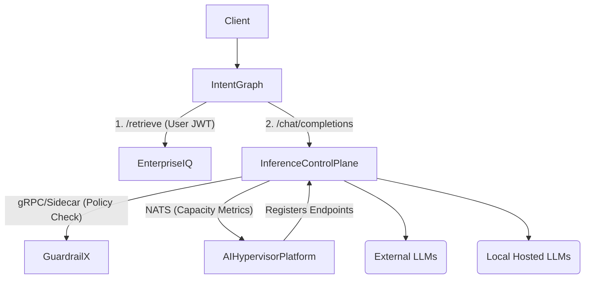

# Architecture Design Review: Enterprise AI Platform (V2)

## Part 1: Brutal Critique of the V1 Architecture

As a Principal/Staff Engineer reviewing the V1 architecture, the proposed design is naive in several critical areas. It suffers from synchronous coupling, massive latency penalties, overlapping responsibilities, and scalability bottlenecks.

### 1. The "Middleware of Death" (Latency & Coupling)
**V1 Design:** `IntentGraph` -> `GuardrailX` -> `Inference Control Plane` -> `LLM`
**Critique:** We have placed `GuardrailX` as a synchronous reverse proxy in front of the Inference Control Plane. This is an architectural anti-pattern.
*   **Latency:** We are adding a full network hop and a heavy compute payload (policy evaluation, PII redaction) *before* the LLM even starts streaming, and potentially during the stream.
*   **Single Point of Failure:** If GuardrailX goes down or scales poorly, the entire AI platform is completely dead.
*   **Coupling:** GuardrailX is now responsible for handling long-lived streaming connections (SSE/WebSockets), which is not its core competency. That is the job of an API Gateway / Inference Router.

### 2. Architectural Overlap & Split Brain (IntentGraph vs EnterpriseIQ)
**V1 Design:** Both `IntentGraph` (Agent orchestration) and `EnterpriseIQ` (Enterprise Agentic RAG) have agentic capabilities and LLM generation logic.
**Critique:** This is a classic split-brain problem. Why is EnterpriseIQ generating answers? If IntentGraph is our Orchestration/DAG execution layer, EnterpriseIQ should *only* be a retrieval engine. By having EnterpriseIQ generate answers, we are duplicating prompt management, LLM SDK usage, and orchestration logic.

### 3. Misaligned Integration (Inference Control Plane & AI Hypervisor)
**V1 Design:** `Inference Control Plane` synchronously depends on `AI Hypervisor Platform` to schedule local models.
**Critique:** The Inference Control Plane is in the hot path of user requests. The AI Hypervisor is a heavy, slow infrastructure control plane (provisioning VMs/GPUs via Libvirt/KVM). Coupling a millisecond-latency data plane to a minute-latency control plane will cause massive timeouts. The Inference Control Plane should not "tell" the hypervisor to spin up models synchronously.

### 4. Security & Context Propagation Gap
**V1 Design:** Mentioned "REST APIs" and "JWTs", but ignored how identity flows through multi-hop chains.
**Critique:** When `IntentGraph` calls `EnterpriseIQ` to retrieve data, how does `EnterpriseIQ` know the user's exact RBAC context? If `IntentGraph` just uses a service account, we violate Zero Trust. We need strict token exchange or JWT passthrough.

---

## Part 2: The Improved V2 Architecture

To build a true enterprise-grade, highly available, and low-latency system, we must invert some dependencies, strip overlapping domains, and strictly separate the control plane from the data plane.

### 1. Invert the Security Gateway (Inference Control Plane as the true Edge)
Instead of GuardrailX acting as a proxy, **Inference Control Plane is the single entry point for all LLM calls.**
*   **Why:** The Inference Control Plane is built for connection management, streaming, rate limiting, and caching.
*   **Integration:** The Inference Control Plane evaluates `GuardrailX` policies via a **high-speed gRPC interceptor or local sidecar**. GuardrailX becomes a stateless evaluation engine, not a traffic proxy.
*   **Result:** Reduced network hops. If GuardrailX is slow, Inference Control Plane can enforce hard timeouts and fail-open/fail-closed based on tenant risk profiles.

### 2. Strip EnterpriseIQ down to a Retrieval Engine
*   **Change:** Remove all LLM generation, answer synthesis, and "Agentic" logic from `EnterpriseIQ`.
*   **Why:** `IntentGraph` is the brain. `EnterpriseIQ` is the memory.
*   **Integration:** `EnterpriseIQ` exposes a pure `/retrieve` endpoint (Hybrid Vector + BM25). `IntentGraph` fetches the raw chunks + citations, and `IntentGraph` is responsible for feeding those into the Inference Control Plane to synthesize the final answer. This centralizes all prompts and agent logic in one repository.

### 3. Event-Driven Infrastructure Scaling (Decoupling Hypervisor)
*   **Change:** `Inference Control Plane` and `AI Hypervisor Platform` communicate asynchronously via NATS.
*   **Why:** When the Inference Control Plane detects sustained queue depth for a specific open-source model, it emits an event (`model.capacity.requested`). The `AI Hypervisor Platform` listens to this, spins up a new VM/GPU, and once the model is ready, registers the new endpoint back with the Inference Control Plane's routing table.
*   **Result:** The hot path is completely decoupled from infrastructure provisioning.

### 4. Strict Identity Propagation (Service Mesh / Gateway)
*   **Change:** Implement strict JWT passthrough.
*   **Why:** When a user initiates an intent in `IntentGraph`, the user's JWT (containing their department and clearance level) is passed directly in the header to `EnterpriseIQ`. `EnterpriseIQ` enforces RBAC *at the vector DB level* based on the user's token, not a generic service token.

### V2 Dependency Graph

### Summary of Component Responsibilities (V2)
*   **IntentGraph:** The *only* agentic orchestrator and prompt manager.
*   **EnterpriseIQ:** Pure data ingestion, RBAC filtering, and hybrid retrieval. No generation.
*   **Inference Control Plane:** The primary LLM gateway, handling all streams, caching, and routing.
*   **GuardrailX:** A high-speed, stateless evaluation engine queried by the Inference Control Plane.
*   **AI Hypervisor Platform:** Asynchronous infrastructure provisioner acting on queue-depth metrics from the control plane.
