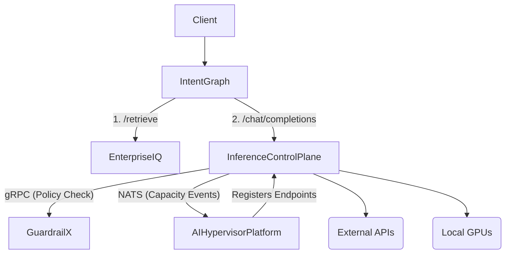
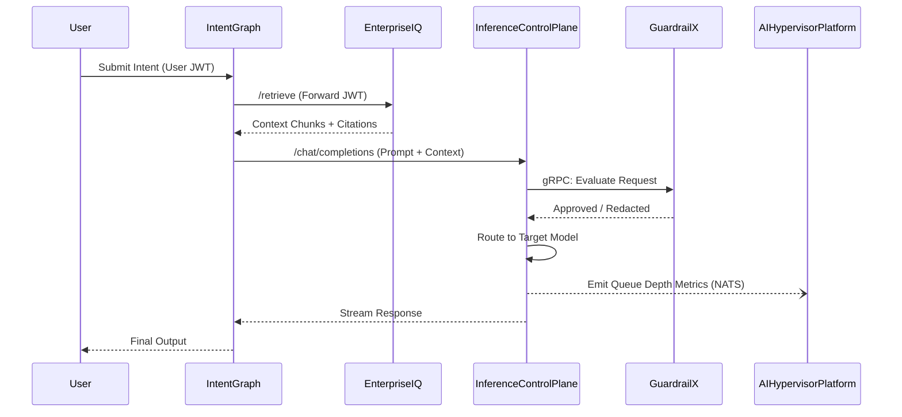

# Enterprise AI Platform Architecture

This document defines the architecture of the unified Enterprise AI Platform, composed of five distinct repositories acting as independent bounded contexts.

## 1. Platform Architecture

The platform is designed as a distributed, microservices-based system avoiding a monolithic structure. It is composed of five bounded contexts:

- **Orchestration Layer:** `IntentGraph`

- **Knowledge & Retrieval Layer:** `EnterpriseIQ`

- **LLM Gateway & Routing Layer:** `Inference Control Plane`

- **Security & Governance Layer:** `GuardrailX`

- **Compute & Infrastructure Layer:** `AI Hypervisor Platform`

Each repository maintains its own domain models and persistence mechanisms, integrating strictly through well-defined APIs and events.

## 2. Repository Responsibilities

- **IntentGraph:** The top-level agentic orchestrator. Responsible for parsing user intents, planning multi-step workflows, executing DAGs, maintaining conversation memory, and managing tool usage.

- **EnterpriseIQ:** A strict retrieval engine. Handles document ingestion, vectorization, and hybrid search (Vector + BM25). It does **not** generate LLM responses or contain agentic logic.

- **Inference Control Plane:** The primary LLM gateway and data plane. Handles connection management, streaming, rate limiting, prompt caching, load balancing, and model routing.

- **GuardrailX:** A stateless governance and evaluation engine. Responsible for prompt injection detection, jailbreak prevention, PII redaction, and enterprise policy enforcement.

- **AI Hypervisor Platform:** Asynchronous infrastructure control plane. Provisions, schedules, and isolates GPU-backed local models on Kubernetes or bare metal.

## 3. Communication Model

- **Synchronous REST:** `IntentGraph` calls `EnterpriseIQ` (`/retrieve`) and `Inference Control Plane` (`/v1/chat/completions`).

- **High-Speed Synchronous (gRPC):** `Inference Control Plane` communicates with `GuardrailX` (acting as a sidecar or close-proximity service) for low-latency policy evaluation.

- **Asynchronous Event-Driven (NATS):** `Inference Control Plane` emits capacity requirement events to `AI Hypervisor Platform`.

- **Service Discovery:** `AI Hypervisor Platform` registers newly spun-up model endpoints back with the `Inference Control Plane`'s dynamic routing table.

## 4. Dependency Graph

## 5. Integration Diagram

## 6. Shared Data Flow

1. A natural language query arrives at `IntentGraph` along with the user's JWT.

2. `IntentGraph` passes the query and JWT to `EnterpriseIQ` to fetch grounding data.

3. `EnterpriseIQ` returns RBAC-filtered chunks.

4. `IntentGraph` synthesizes a final prompt and sends it to `Inference Control Plane`.

5. `Inference Control Plane` offloads the payload to `GuardrailX` for security checks.

6. The sanitized prompt is dispatched to the model, and tokens stream back through the layers to the client.

## 7. Authentication Flow

- **Strict JWT Passthrough:** Authentication is evaluated at the edge (IntentGraph), but authorization propagates down the stack.

- `IntentGraph` extracts the Bearer token and passes it in headers to `EnterpriseIQ` and `Inference Control Plane`.

- `EnterpriseIQ` uses the token's claims to apply tenant and department-level filters on the vector database (Zero Trust data access).

- Services do not use generic "Service Accounts" for actions initiated by a user.

## 8. Request Lifecycle

1. **Ingress:** Request accepted by IntentGraph.

2. **Retrieval:** EnterpriseIQ queries local knowledge bases.

3. **Orchestration:** IntentGraph formats context.

4. **Gateway Interception:** Inference Control Plane manages rate limits and caching.

5. **Governance:** GuardrailX evaluates policies.

6. **Execution:** Request sent to model.

7. **Streaming:** SSE/WebSockets flow seamlessly back to IntentGraph and User.

## 9. Deployment Architecture

- **IntentGraph & EnterpriseIQ:** Deployed as scalable stateless Deployments in Kubernetes (EnterpriseIQ connects to managed Chroma/Milvus).

- **Inference Control Plane:** Highly scaled Deployment with Redis for distributed caching.

- **GuardrailX:** Deployed as a DaemonSet or injected as a sidecar container to the Inference Control Plane pods to ensure sub-millisecond network hops.

- **AI Hypervisor Platform:** Deployed as a Kubernetes Operator/Controller managing custom resource definitions (CRDs) for GPU workloads.

## 10. API Gateway Design

- `Inference Control Plane` acts as the single LLM Gateway.

- It exposes a standard OpenAI-compatible API (`/v1/chat/completions`).

- All other repositories (`IntentGraph`, `EnterpriseIQ` if needed for embeddings) interact with AI models exclusively through this gateway.

- Avoids duplicated logic for provider SDKs, retries, and token accounting across repositories.

## 11. Event Flow

- Scaling is driven by queue depths, not just CPU.

- `Inference Control Plane` monitors pending requests per model and emits `model.capacity.requested` to a NATS JetStream topic.

- `AI Hypervisor Platform` subscribes to this topic, provisions a new VM/Pod with GPU passthrough.

- Upon readiness, `AI Hypervisor Platform` emits `model.instance.ready` or directly updates the Control Plane's routing table.

## 12. Failure Handling

- **Circuit Breakers:** `Inference Control Plane` tracks upstream LLM error rates and automatically falls back to secondary models (e.g., GPT-4 fails -> fallback to Claude 3.5).

- **Fail-Open/Fail-Closed:** Governance failures (GuardrailX unavailability) default to configurable fallback modes based on tenant risk profiles.

- **Graceful Degradation:** If `EnterpriseIQ` is degraded, `IntentGraph` can continue without context, explicitly informing the user.

## 13. Observability Architecture

- **Distributed Tracing (OTLP):** A `traceparent` and `x-request-id` header is injected at IntentGraph and propagated through all inter-service REST/gRPC calls.

- **Centralized Metrics:** Prometheus scrapes `/metrics` from all components (Python/FastAPI and Go).

- **Audit Logging:** Any redaction or blocked prompt by `GuardrailX` is logged asynchronously to a centralized audit store for compliance.

## 14. Security Architecture

- **mTLS:** Enforced between all repositories via a Service Mesh (e.g., Istio or Linkerd).

- **Data Protection:** `GuardrailX` ensures no sensitive PII leaks to external LLM providers.

- **Compute Isolation:** `AI Hypervisor Platform` provides strict multi-tenant isolation at the VM/Hypervisor level when running local models.

## 15. Extension Model

- **Custom Tools:** Developers can register new tools in `IntentGraph` via an OpenAPI schema registry without touching core logic.

- **Custom Policies:** Security teams can inject new Python-based or Rego-based rules into `GuardrailX` dynamically.

- **New Providers:** Integrating a new LLM provider requires only a single adapter class in the `Inference Control Plane`.
