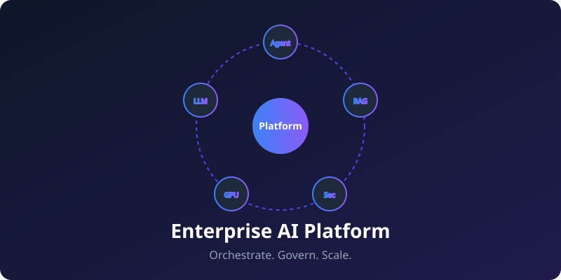
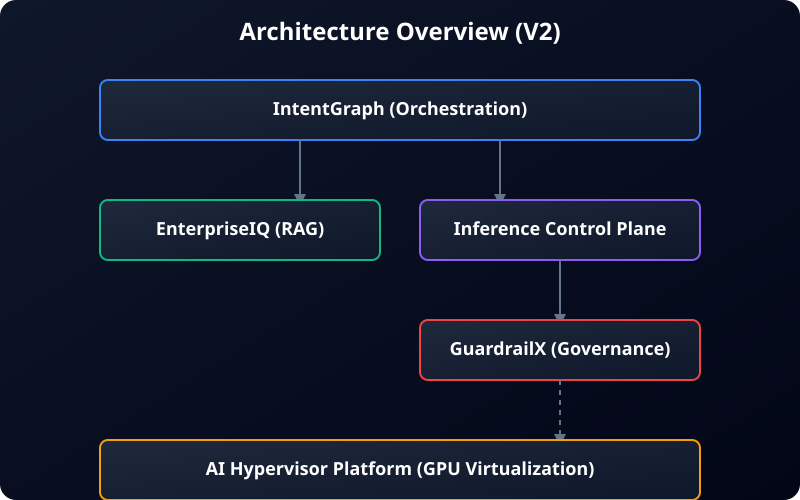

<div align="center">
  

  <br />
  <br />

  <p>
    <b>The open-source, production-ready system for orchestrating, governing, and scaling AI workloads.</b>
  </p>

  <p>
    <a href="https://github.com/ai-platform/ai-platform/actions"></a>
    <a href="https://github.com/ai-platform/ai-platform/blob/main/LICENSE"></a>
    <a href="https://github.com/ai-platform/ai-platform/pulls"></a>
    <a href="https://github.com/ai-platform/ai-platform/issues"></a>
  </p>
</div>

---

## 📖 Overview

The **Enterprise AI Platform** is a distributed, microservices-based system designed to solve the complexities of deploying Generative AI in enterprise environments. It moves beyond monolithic prototypes, providing a robust architecture consisting of five independent bounded contexts:

1.  **IntentGraph:** Agent Orchestration & Planning.
2.  **EnterpriseIQ:** Zero-Trust Hybrid RAG.
3.  **Inference Control Plane:** High-Throughput LLM Gateway.
4.  **GuardrailX:** Sub-millisecond Policy Engine.
5.  **AI Hypervisor Platform:** GPU Compute Virtualization.

### Why this exists

Deploying AI in the enterprise requires more than just calling an API. It requires strict data governance, dynamic infrastructure scaling, prompt injection defense, and reliable agentic orchestration. The Enterprise AI Platform provides a unified, highly opinionated, yet loosely coupled ecosystem to handle these requirements at scale.

### The Solution

By decoupling orchestration (IntentGraph), governance (GuardrailX), and compute (AI Hypervisor), the platform ensures that:
- Developers can build complex agents without worrying about underlying model routing.
- Security teams can enforce policies without slowing down the hot path.
- Infrastructure teams can dynamically spin up local GPU models based on real-time queue depth.

---

## 🏗️ Architecture Overview

The system strictly adheres to the principle of decoupled bounded contexts.

<div align="center">
  
</div>

1.  **Ingress:** A natural language query arrives at `IntentGraph` (Python/Poetry) along with the user's JWT.
2.  **Retrieval:** `IntentGraph` passes the query and JWT to `EnterpriseIQ` to fetch RBAC-filtered grounding data.
3.  **Gateway Routing:** `IntentGraph` synthesizes a prompt and sends it to the `Inference Control Plane` (FastAPI).
4.  **Governance Check:** The Control Plane intercepts the request and performs a sub-millisecond gRPC check against `GuardrailX`.
5.  **Compute Scaling:** If capacity is low, the Control Plane emits NATS events, triggering the `AI Hypervisor Platform` (Go) to spin up new GPU VMs.
6.  **Streaming:** The sanitized prompt is dispatched to the model, and tokens stream seamlessly back to the client.

For a deeper dive, see our [Internal Architecture Documentation](docs/architecture.md).

---

## 🛠️ Technology Stack

| Component | Stack | Responsibilities |
| :--- | :--- | :--- |
| **IntentGraph** | Python 3.10, Poetry, pytest | Dependency Graph Parsing, Agent Orchestration |
| **Inference Control Plane** | Python/FastAPI, Redis, PostgreSQL | LLM Routing, Provider Abstraction, Rate Limiting |
| **GuardrailX** | Python/FastAPI, React | Governance, Policy Engine, PII Redaction |
| **EnterpriseIQ** | Python, Vector DB (Chroma/Milvus) | Hybrid Search, Data Ingestion, RBAC Retrieval |
| **AI Hypervisor Platform** | Go, Kubernetes, KVM/QEMU | GPU Virtualization, Compute Isolation |
| **Dashboard** | React, TypeScript, Vite, Tailwind | Front-end SPA, UI Mockups |

---

## 📂 Folder Structure

```text
ai-platform/
├── IntentGraph/               # Core agent orchestration and planning
├── Inference-Control-Plane/   # LLM routing gateway and caching
├── GuardrailX/                # Policy enforcement and prompt injection detection
├── enterpriseiq/              # (EnterpriseIQ) Knowledge and RAG engine
├── ai-hypervisor-platform/    # Compute infrastructure and GPU orchestration
├── dashboard/                 # Frontend SPA and mock UI playgrounds
├── docs/                      # Platform-wide documentation & architecture
└── examples/                  # E2E sample apps and integration patterns
```

---

## 🚀 Quick Start

The platform is designed to be easily runnable locally. You will need **Docker**, **Python 3.10+**, and **Go 1.20+**.

### 1. Clone the repository
```bash
git clone https://github.com/ai-platform/ai-platform.git
cd ai-platform
```

### 2. Verify Component Installations
Because the components are loosely coupled, you can install and test them independently.

**IntentGraph (Orchestrator):**
```bash
cd IntentGraph
poetry install
poetry run pytest
cd ..
```

**Inference Control Plane (Gateway):**
```bash
cd Inference-Control-Plane
pip install -r requirements.txt
pytest
cd ..
```

**GuardrailX (Security):**
```bash
cd GuardrailX/backend
pip install -r requirements.txt
PYTHONPATH=. pytest
cd ../..
```

*(Refer to the [Getting Started Guide](docs/getting-started.md) for full docker-compose instructions when available).*


---

## ⚙️ Configuration

Each component uses its own `.env` file for configuration to maintain strict bounded contexts. See the individual directories for specific `.env.example` files.

General platform configuration concepts can be found in the [Configuration Documentation](docs/configuration.md).

---

## 👨‍💻 Developer Guide

### Project Internals
If you want to understand the deep technical decisions behind the platform, please review our internal documentation:
- [Design Decisions & Principles](DESIGN.md)
- [System Architecture](docs/architecture.md)
- [Performance Characteristics](docs/performance.md)
- [Security Model](docs/security.md)

### Troubleshooting
Having issues?
1. Check the [FAQ](docs/faq.md) for common questions.
2. Review our [Troubleshooting Guide](docs/troubleshooting.md).
3. Open an issue using our [Bug Report Template](.github/ISSUE_TEMPLATE/bug_report.md).

---

## 🗺️ Roadmap

We are actively developing the platform. See our [Roadmap](ROADMAP.md) to understand where we are heading (e.g., Kubernetes operators, BYOD capabilities).

---

## 🤝 Contributing

We welcome contributions! Please review our [Contributing Guidelines](CONTRIBUTING.md) and [Code of Conduct](CODE_OF_CONDUCT.md) before submitting a Pull Request.

---

## 📄 License

This project is licensed under the [MIT License](LICENSE).

---

## 🙏 Acknowledgements
Built by the community, for the community.
