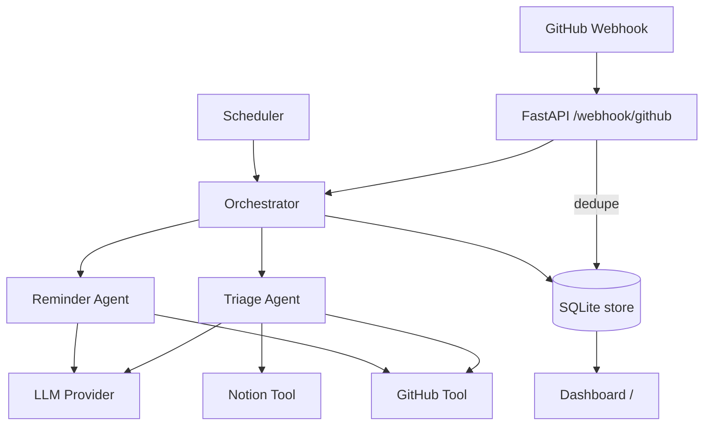

# 🤖 Agentic AI Automation

A production-grade, autonomous workflow automation system. LLM-powered agents triage GitHub issues, chase stale PRs, and keep a Notion hub in sync — with idempotent webhooks, retries, persistence, a live dashboard, and a clean provider abstraction.

[](./.github/workflows/ci.yml)

## ✨ Highlights

- **Two autonomous agents** built on a model-agnostic ReAct loop (Reason → Act → Observe)
  - **Triage Agent** — auto-labels & prioritizes issues/PRs and comments
  - **Reminder Agent** — nudges stale PRs on a schedule
- **Pluggable LLM providers** — OpenAI *or* Anthropic via one interface (`agents/llm.py`)
- **Idempotent webhooks** — GitHub deliveries are de-duplicated via SQLite, processed in the background so responses stay <10s
- **Resilient HTTP** — exponential backoff + jitter, honors `Retry-After` on 429/5xx (`tools/resilience.py`)
- **Persistence & audit log** — every agent run is recorded (`store/db.py`)
- **Live dashboard** at `/` + JSON metrics at `/metrics`
- **Structured JSON logging**, typed Pydantic event models, CLI, Docker, and CI

## 🚀 Quick start

```bash
pip install -e ".[dev]"      # or: pip install -r requirements.txt
cp .env.example .env         # fill in keys
make run                     # uvicorn main:app --reload
```

Then open **http://localhost:8000** for the dashboard.

### CLI (no server needed)

```bash
python cli.py triage      # triage all open issues
python cli.py reminders   # nudge stale PRs
python cli.py stats       # print run stats
```

### Run the tests

```bash
make test
```

## 🔌 API

| Method | Path | Description |
|---|---|---|
| `GET`  | `/` | Live dashboard |
| `GET`  | `/health` | Liveness probe |
| `GET`  | `/metrics` | Run stats (JSON) |
| `POST` | `/webhook/github` | GitHub webhook receiver (signature-verified, idempotent) |
| `POST` | `/trigger/triage` | Run full triage now |
| `POST` | `/trigger/reminders` | Run reminder sweep now |

## ⚙️ Configuration

All config is env-driven (see `.env.example`). Notable switches:

| Variable | Default | Notes |
|---|---|---|
| `LLM_PROVIDER` | `openai` | `openai` or `anthropic` |
| `LLM_MODEL` | `gpt-4o` | Any chat model for the chosen provider |
| `GITHUB_WEBHOOK_SECRET` | _(empty)_ | If set, all webhooks are HMAC-verified |
| `NOTION_TOKEN` / `NOTION_DATABASE_ID` | _(empty)_ | Leave blank to disable Notion sync |
| `REMINDER_INTERVAL_HOURS` | `24` | Reminder sweep cadence |

## 🏗 Architecture



## 📜 License

MIT
