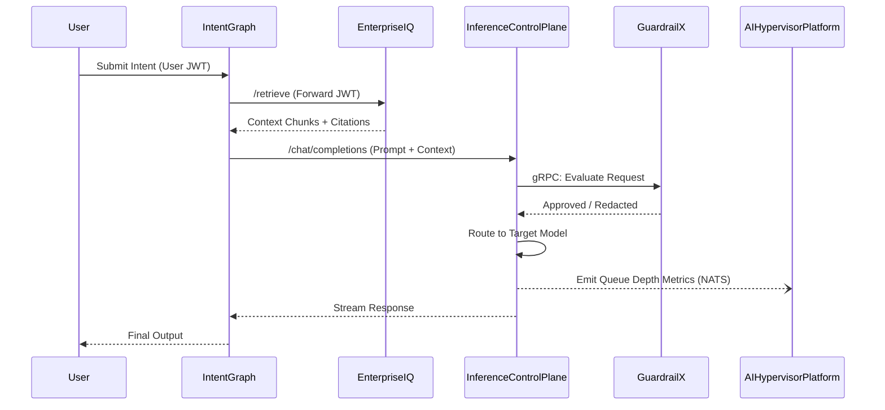

# Architecture

The platform is designed as a distributed, microservices-based system avoiding a monolithic structure. It is composed of five bounded contexts.

## Execution Flow

See [Design](design.md) for more details.
