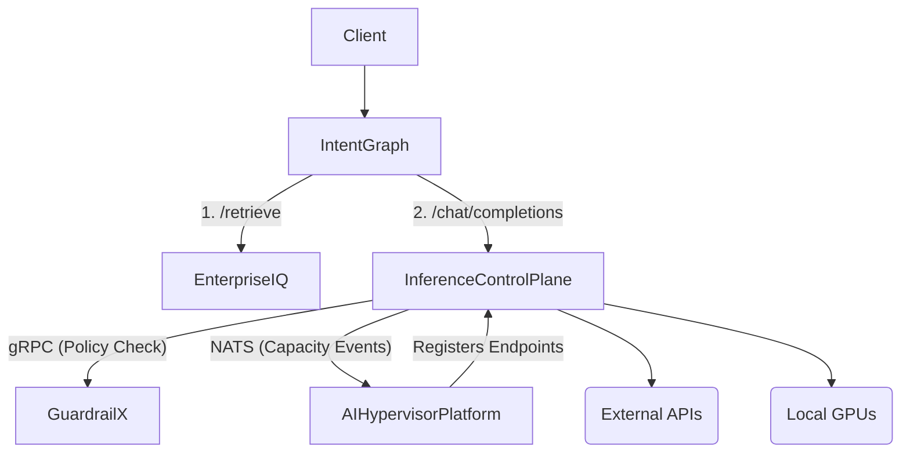

# System Design

## Component Relationships

```mermaid
graph TD
    Client --> IntentGraph
    IntentGraph -- "1. /retrieve" --> EnterpriseIQ
    IntentGraph -- "2. /chat/completions" --> InferenceControlPlane
    InferenceControlPlane -- "gRPC (Policy Check)" --> GuardrailX
    InferenceControlPlane -- "NATS (Capacity Events)" --> AIHypervisorPlatform
    AIHypervisorPlatform -- "Registers Endpoints" --> InferenceControlPlane
    InferenceControlPlane --> ExternalLLMs(External APIs)
    InferenceControlPlane --> LocalLLMs(Local GPUs)
```
