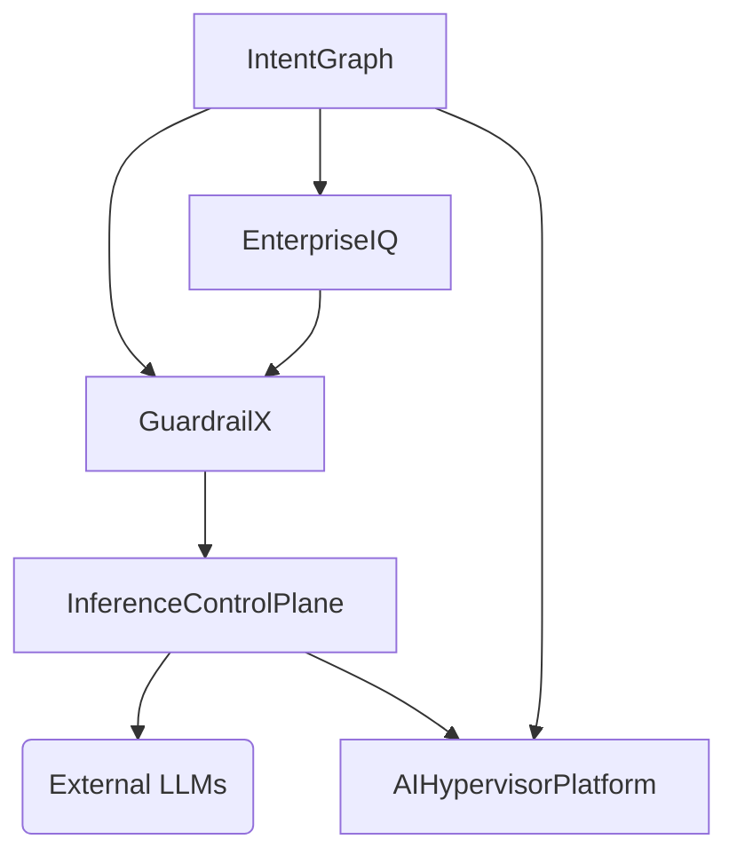

# Phase 1: Repository Review

### 1. IntentGraph
- **Purpose**: Agent orchestration, planning, workflow execution, memory, DAG execution.
- **Tech Stack**: Python, NetworkX, Pydantic, Poetry (Based on pyproject.toml and source). Next.js frontend, Node.js tooling mentioned in README. (There seems to be a discrepancy between README mentioning Node/Next.js and actual source containing Python. The python source focuses on `intentgraph` package doing dependency graph parsing, but README talks about "multi-tenant action OS"). Let's assume the Python codebase is the core orchestration/DAG engine.
- **Role in Platform**: The central orchestration layer. Receives user intents, plans workflows, executes DAGs.

### 2. Inference Control Plane
- **Purpose**: LLM routing, provider abstraction, caching, rate limiting, failover, traffic management.
- **Tech Stack**: Python, FastAPI, SQLAlchemy, Redis, PostgreSQL, Alembic.
- **Role in Platform**: The gateway to LLMs. All other components (IntentGraph, EnterpriseIQ, GuardrailX) should route their LLM calls through this component to ensure consistent caching, rate limiting, and failover.

### 3. GuardrailX
- **Purpose**: Enterprise AI governance, prompt injection detection, jailbreak prevention, PII protection, policy enforcement.
- **Tech Stack**: Python, FastAPI, SQLAlchemy.
- **Role in Platform**: The security and compliance layer. intercepts prompts and responses to enforce policies before they hit the Inference Control Plane or return to the user.

### 4. EnterpriseIQ
- **Purpose**: Enterprise Agentic RAG platform with hybrid retrieval and enterprise knowledge management.
- **Tech Stack**: Python, FastAPI, ChromaDB, SentenceTransformers.
- **Role in Platform**: The knowledge and context engine. Provides grounded, RBAC-filtered context to the agents in IntentGraph.

### 5. AI Hypervisor Platform
- **Purpose**: GPU-aware virtualization, compute isolation, workload placement, AI infrastructure layer.
- **Tech Stack**: Go, Kubernetes, Libvirt, NVML, NATS, PostgreSQL, Redis.
- **Role in Platform**: The foundational infrastructure layer. Provisions and manages the compute resources (GPUs, VMs) where the other components (or dedicated inference models) run.

# Phase 2: Architectural Map

- **Layer 1: Infrastructure & Compute (AI Hypervisor Platform)**
  - Manages physical/virtual nodes, GPUs, and provides compute resources for the platform.
- **Layer 2: Data & Knowledge (EnterpriseIQ)**
  - Manages enterprise data ingestion, vectorization, RBAC-filtered retrieval.
- **Layer 3: Security & Governance (GuardrailX)**
  - Sits between the application layer and inference layer to enforce policies.
- **Layer 4: Core Inference & Routing (Inference Control Plane)**
  - Abstracts LLM providers, handles load balancing, caching, and failover.
- **Layer 5: Orchestration & Application (IntentGraph)**
  - User-facing layer, plans workflows, manages agent state, memory, and calls out to tools/EnterpriseIQ.

# Phase 3: Dependency Graph


*Note: GuardrailX can be a proxy to Inference Control Plane or a sidecar.*

# Phase 4: Interfaces
- **IntentGraph -> GuardrailX**: REST API / gRPC interceptor for prompt validation.
- **GuardrailX -> Inference Control Plane**: REST API (OpenAI-compatible).
- **IntentGraph -> EnterpriseIQ**: REST API for knowledge retrieval (`/query`).
- **All -> AI Hypervisor Platform**: Kubernetes APIs / NATS for dynamic resource provisioning.

# Phase 5: Shared Libraries
Extract:
1. `platform-telemetry` (OpenTelemetry tracing, logging).
2. `platform-auth` (JWT validation, RBAC schemas).
3. `platform-llm-client` (Standardized SDK to call Inference Control Plane).

# Phase 6: GitHub Organization Structure
```text
enterprise-ai-platform/
├── core-orchestration (IntentGraph)
├── inference-gateway (Inference Control Plane)
├── ai-governance (GuardrailX)
├── knowledge-engine (EnterpriseIQ)
├── compute-hypervisor (AI Hypervisor Platform)
├── libs/
│   ├── platform-telemetry
│   ├── platform-auth
│   └── platform-llm-client
├── docs/
└── deployments/ (Helm charts, GitOps)
```

# Phase 7: Shared Concerns
- **Auth**: Centralized OIDC provider (e.g., Keycloak), standard JWT validation in `platform-auth`.
- **Logging/Telemetry**: Unified OpenTelemetry collector pushing to Prometheus/Jaeger.
- **Configuration**: Standardized ENV variable naming, possible ConfigMap/Secret management via Vault.
- **Releases**: Semantic versioning across all repos using standard GitHub Actions.
